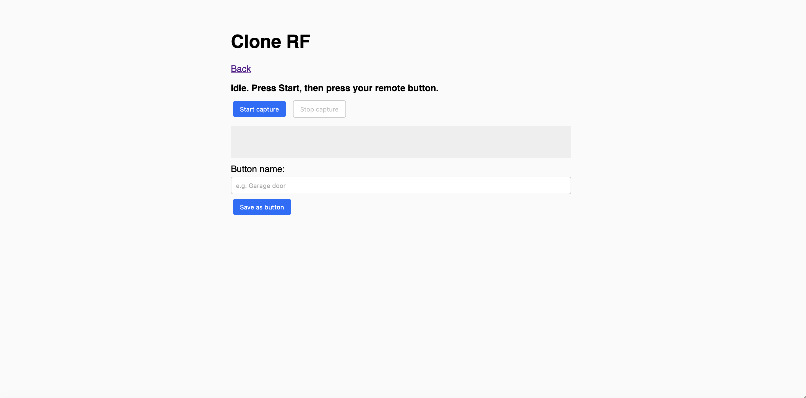
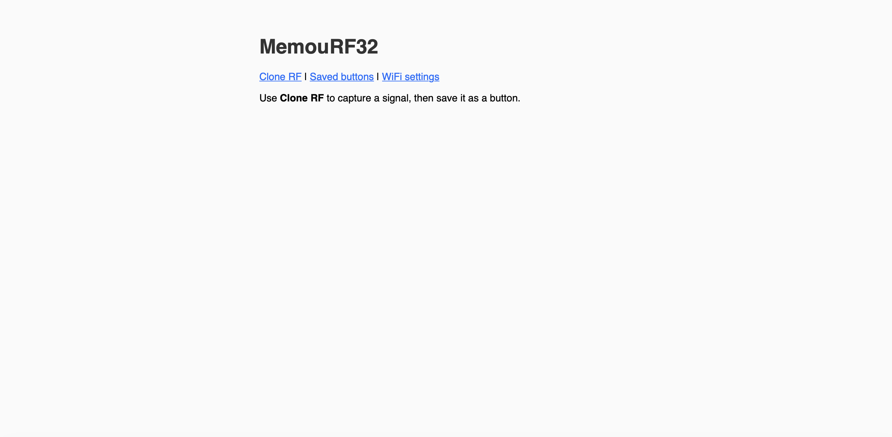

# MemouRF32

Custom firmware for **TTGO LoRa32 v2.1** (ESP32 + SX1276 @ 433 MHz). Lets you **clone** 433 MHz RF signals, **save** them as named buttons, and expose them to **Home Assistant via HomeKit**.

## Features

- **Web UI** (when connected to WiFi): login, clone RF, save as button, list/trigger/delete buttons
- **Clone**: capture raw OOK pulses from your remote; save as a new button
- **Saved buttons**: stored in LittleFS; trigger from web or from HomeKit
- **HomeKit**: device appears as a bridge with up to 24 programmable switches (one per saved button slot). Add the accessory in the **Home** app; then use **Home Assistant → HomeKit** integration to discover it

## Screenshots

| Web UI | Clone RF / Saved buttons |
|--------|---------------------------|
|  |  |

## Hardware

- Board: **TTGO LoRa32 v2.1** (e.g. `ttgo-lora32-v21` in PlatformIO)
- Pins (aligned with your ESPHome YAML): SPI 5/27/19, SX127x CS=18, RST=23, RF data=GPIO32

## Build & flash

1. **Build and upload** (PlatformIO):
   ```bash
   pio run
   pio run -t upload
   ```
   Or use the PlatformIO IDE (VSCode/Cursor): open the project and use **Build** / **Upload**.

2. **Serial monitor** (optional):
   ```bash
   pio device monitor -b 115200
   ```

## First use

1. **Power the board.** It starts as a **hotspot** by default (no WiFi configured yet):
   - SSID: **MemouRF32**
   - Password: **memourf32**
2. **Connect your phone/PC** to the hotspot, then open a browser and go to **http://192.168.4.1** (or any address — captive portal will redirect you).
3. **Enter your home WiFi** name (SSID) and password, then tap **Save and connect**. The device reboots and connects to your WiFi.
4. Find the device IP (router DHCP list or serial monitor), then open **http://\<device-ip\>** in a browser. Log in with:
   - User: `admin`
   - Password: `memourf32`  
   (change these in `include/config.h`: `WEB_USER`, `WEB_PASS`).

5. **Clone an RF signal**
   - Go to **Clone RF**.
   - Click **Start capture**, then press your remote (garage, fan, etc.).
   - Click **Stop capture**. You should see a list of pulse lengths.
   - Enter a name and click **Save as button**.

6. **Saved buttons**
   - Open **Saved buttons**: you can **Send** (replay) or **Delete** each button.

7. **HomeKit**
   - In the **Home** app (iOS): Add Accessory → **MemouRF32** (or “RF Button” entries).
   - Pairing code: **120-81-208** (also shown in Serial / HomeSpan).
   - In **Home Assistant**: add the **HomeKit** integration and discover the bridge; the switches map to your saved buttons by index (first saved button = first switch, etc.).

## Configuration

| Item | Where | Default |
|------|--------|--------|
| Hotspot (AP) | `config.h` | `AP_SSID` "MemouRF32", `AP_PASSWORD` "memourf32" |
| WiFi credentials | Set via hotspot config page; stored in NVS | — |
| STA connect timeout | `config.h` | `WIFI_CONNECT_TIMEOUT_MS` (15 s) |
| Web login | `config.h` | `WEB_USER`, `WEB_PASS` |
| Max saved buttons | `config.h` | `MAX_SAVED_BUTTONS` (24) |
| Clone timeout | `config.h` | `CLONE_CAPTURE_MS` (10 s) |

To **reconfigure WiFi** after setup: open **http://\<device-ip\>/wifi**, enter new SSID/password, and save (device reboots and connects to the new network).

## Project layout

- `platformio.ini` – PlatformIO env (board, libs)
- `include/config.h` – Pins, WiFi, web auth, limits
- `src/main.cpp` – WiFi, web server, API, HomeSpan setup
- `src/storage.cpp/h` – LittleFS save/load of buttons
- `src/rf_handler.cpp/h` – SX127x OOK, GPIO32 capture/replay

## License

Use and modify as you like; no warranty.
